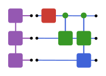

<h1 align="center">
  <br>
  
  <br>
  QILaplace.jl
  <br>
</h1>

<h4 align="center">Quantum-inspired signal transforms via tensor network representations.</h4>

<p align="center">
  <a href="https://github.com/SUTD-MDQS/QILaplace.jl/actions/workflows/CI.yml">
    
  </a>
  <a href="https://julialang.org">
    
  </a>
  <a href="https://arxiv.org/abs/2601.17724">
    
  </a>
  <a href="https://codecov.io/gh/SUTD-MDQS/QILaplace.jl">
    
  </a>
</p>

<p align="center">
  <a href="#quickstart-tour">Quickstart</a> •
  <a href="#when-to-use-qilaplace">When to Use</a> •
  <a href="#why-tensor-network-transforms">Why Tensor Networks?</a> •
  <a href="#core-features">Core Features</a> •
  <a href="#performance">Performance</a>
</p>

QILaplace.jl is a Julia library for implementing **quantum-inspired signal transforms**—most notably the **Quantum Fourier Transform (QFT)** and **Discrete Laplace (aka z-Transform)** variants—using **tensor-network representations**. The package is built on **Matrix Product States** (MPS) and **Matrix Product Operators** (MPOs) and runs entirely on classical hardware via ITensors.jl.

The central idea is to leverage the representability of certain quantum circuits as MPOs and realize their action through efficient tensor-network contractions. This allows us to study, prototype, and apply QFT-like transforms at problem sizes far beyond what dense representations would permit—**without requiring a quantum computer**. For compressible signals, this reaches performance better than—classical algorithms like FFT and Chirp-z, while handling problem sizes (input size $\approx 2^{30}$, output size $\approx 2^{60}$) that would be infeasible in dense form.

## Why tensor-network transforms?

### The classical state of the art

For discrete signal transforms, classical algorithms are extremely effective—but they implicitly assume **dense access** to all signal samples:

- **Discrete Fourier Transform (FFT)**\
  Runtime: **$O(N \ \log(N))$**\
  Requires storing and processing all $N$ samples explicitly.

- **Discrete Laplace / z-transform**\
  Naive implementations scale as **$O(N^2)$** and can suffer from numerical instability at large $N$. However, several *fast classical alternatives* exist for specific evaluation settings:

  - **Fast evaluation on the positive real axis:** using specialized schemes, evaluation along the real axis can be performed in **effectively linear or near-linear time** with cost **$O(N + M)$**.
  - **Chirp-z transform (CZT):** reduces evaluation along specific contours in the complex plane to FFT-like convolutions, with cost **$O((N + M)\ \log(N + M))$**.
  - **Dense 2D evaluation grids:** typical scaling **$O(N·M)$**.

  These algorithms substantially outperform brute-force Laplace evaluation, but still fundamentally rely on *dense access to the signal* and do not exploit internal low-rank or entanglement structure.

However, many real-world signals are **structured and compressible**, with most of their "useful" information concentrated in a small number of dominant modes. Such signals admit low-rank representations and can be faithfully approximated with far fewer degrees of freedom than their ambient dimension suggests. QILaplace.jl adopts a tensor-network perspective:

- Signals of length $N$ are represented as **MPS with $\log_2(N)$ sites**
- Transform operators are constructed by efficiently contracting **logarithmic-depth MPO circuits**
- Approximation error, compression, and circuit structure are **explicitly controlled**

For signals admitting a bounded MPS bond dimension, this leads to a radically different scaling regime.


### What this package provides

QILaplace.jl implements three quantum-inspired discrete transforms:

- **Quantum Fourier Transform (QFT)**\
  A circuit-structured alternative to the FFT, realized as a finite-bond-dimension MPO.

- **Discrete Laplace Transform with real exponents (Damping Transform)**\
  Suitable for exponentially damped signals and decay analysis.

- **Full complex Discrete Laplace / z-Transform (zT)**\
  A tensor-network formulation of the classical z-transform, enabling pole–zero analysis directly from tensor states.


## Performance

The transform operators in QILaplace.jl correspond to **logarithmic-depth quantum circuits** represented as MPOs. Prior work of [Chen, Stoudenmire, and White](https://journals.aps.org/prxquantum/abstract/10.1103/PRXQuantum.4.040318) has shown that QFT circuits admit an MPO representation with a **finite bond dimension** that does **not scale with system size** for fixed accuracy. We have observed the same behavior in the case of the discrete Laplace transform as well. 

Input signals are represented as MPS with bond dimension $\chi_s$, determined by the structure and complexity of the data. Structured or weakly correlated signals admit compact representations, while more complex signals may require larger bond dimensions.

Transforms are applied via MPO–MPS contraction. The computational cost scales as:

- Linear in the number of tensor sites: **$n = \log_2(N)$**
- Polynomial in the signal bond dimension $\chi_s$
- Polynomial in the circuit bond dimension $\chi_c$ (constant for fixed accuracy)

For fixed circuit accuracy, the effective runtime is **$O(\chi_s^2 \log(N))$**.

### Runtime comparison

| Transform                  | Best-known algorithm                        | Best-known classical runtime   | QILaplace runtime\* |
| -------------------------- | ------------------------------------------- | ------------------------------ | ------------------- |
| Discrete Fourier Transform | FFT (Cooley–Tukey)                          | $O(N \log(N))$                 | $O(\chi_s^2 \log(N))$        |
| z-Transform (complex)      | Chirp-z transform (CZT)                     | $O((N+M)\ \log(N + M))$        | $O(\chi_s^2 \log(N))$        |
| QFT (quantum circuit)      | Quantum QFT circuit                         | $O(\log^2(N))$†                | $O(\chi_s^2 \log(N))$        |

\* For signals admitting bounded MPS bond dimension.

† Idealized quantum circuit, ignoring state preparation, readout, and noise overheads.

In other words, **when the signal is compressible**, transform costs scale logarithmically with signal length. In this regime, tensor-network implementations can be competitive with—and in practice outperform—both dense classical algorithms and idealized quantum-circuit implementations for large data sizes, while running entirely on classical hardware.


## Core features

### Signal generation and representation

- Signals are represented as MPS objects (e.g. `SignalMPS`, `zTMPS`)
- Dense arrays can be compressed using SVD or randomized SVD (rSVD)
- Built-in utilities generate oscillatory, damped, and structured test signals

### Transform construction

- QFT, damping-transform, and z-transform operators are constructed as MPOs
- Circuit-style MPO building blocks:
  - `SingleSiteMPO`
  - `PairedSiteMPO`
- High-level builders:
  - `build_qft_mpo`
  - `build_dt_mpo`
  - `build_zt_mpo`

### Transform application

- Generic interface: `*(::AbstractMPO, ::AbstractMPS)`
- Outputs are produced in **bit-reversed order**, matching the natural QFT circuit layout

### Post-processing and analysis

- Pole and zero extraction directly from transformed tensor states (yet to implement)
- Parameter estimation and spectral analysis tools (planned)

## When to use QILaplace

**Ideal for:**
- ✅ Structured or compressible signals (oscillatory, damped, low-rank)
- ✅ Large signal lengths ($N \geq 2^{20}$) where dense FFT/Laplace become memory-intensive

**Not ideal for:**
- ❌ Fully random or high-entropy signals (minimal compression; overhead outweighs gains)

## Quickstart tour

### Signal → MPS → QFT frequency bins
The most common workflow is: synthesize a structured signal, compress it into an MPS, build the desired MPO, and contract. The example below produces a damped multi-tone waveform, applies the QFT circuit, and probes any frequency bin directly from the resulting tensor state without materializing a dense vector.

```julia
using QILaplace

n = 10                                            # log2 signal length → 1024 samples
signal = generate_signal(n; kind=:sin_decay,
                         freq=[1.0, 2.5], decay_rate=[0.08, 0.03])

ψ, norm = signal_mps(signal; method=:rsvd, cutoff=1e-9, maxdim=64)
compress!(ψ; maxdim=64)

Wqft = build_qft_mpo(ψ; cutoff=1e-12, maxdim=128)
spectrum = Wqft * ψ                                # Apply MPO to MPS

# Extract amplitude at frequency bin (bit-reversed order)
amplitude = coefficient(spectrum, "0101010110") * norm
```

### Damped signals and z-Transform pipeline
When working with Laplace/zT analyses you need the doubled register representation (`zTMPS`) so that both main and copy wires stay entangled. The snippet below chains the damping transform and the full z-transform MPOs and inspects an amplitude in the z-space directly from the contracted tensor.

```julia
using QILaplace

n = 10
signal = generate_signal(n; kind=:sin_decay, freq=1.0, decay_rate=0.05)

ψzt, norm = signal_ztmps(signal; method=:svd, cutoff=1e-12)

Wdt = build_dt_mpo(ψzt, 0.3; maxdim=64)
damped = Wdt * ψzt                               # Apply damping transform

Wzt = build_zt_mpo(ψzt, 0.3; maxdim=128)
response = Wzt * damped                          # Apply full z-transform

amplitude = coefficient(response, "1010101010") * norm  # Extract & denormalize
```

### Performance highlight
**We have computed the z-Transform** of signals with $N \approx 2^{30}$ (≈1 billion data points) and stored the result in an MPS with $M \approx 2^{60}$ (≈1 million-trillion transform evaluations)—a regime completely inaccessible to dense classical methods!


## Authorship and maintenance

This repository supports the work reported in an upcoming arXiv manuscript.

- **Original author:** **Noufal Jaseem**\
  Developed the original implementation and core workflow used to generate the results reported in the manuscript.

- **Lead maintainer / major contributor:** **Gauthameshwar S.**\
  Curated and structured the repository, improved code quality and usability, and implemented targeted efficiency optimizations. The optimized implementation was used to update the runtime figures in the main manuscript.

- **Project supervision:** **Dario Poletti**\
  Provided scientific supervision and guidance for the project.


## Citation

If you use QILaplace.jl in published work, please cite the repository and the associated arXiv paper [here](https://arxiv.org/abs/2601.17724).

Made with ❤️ using Julia, ITensors, and a healthy respect for bond-dimension growth.

---
