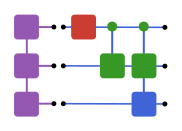

<h1 align="center">
  <br>
  
  <br>
  QILaplace.jl
  <br>
</h1>

<h4 align="center">Quantum-inspired signal transforms via tensor-network representations.</h4>

<p align="center">
  <a href="https://github.com/SUTD-MDQS/QILaplace.jl/actions/workflows/CI.yml">
    
  </a>
  <a href="https://julialang.org">
    
  </a>
  <a href="https://arxiv.org/abs/2601.17724">
    
  </a>
  <a href="https://codecov.io/gh/SUTD-MDQS/QILaplace.jl">
    
  </a>
  <a href="https://github.com/JuliaTesting/Aqua.jl">
    
  </a>
</p>

<p align="center">
  <a href="https://SUTD-MDQS.github.io/QILaplace.jl">
    
  </a>
</p>

<p align="center">
  <a href="#what-this-package-provides">What this package provides</a> •
  <a href="#core-features">Core features</a> •
  <a href="#quickstart-tour">Quickstart</a> •
  <a href="#performance">Performance</a> •
  <a href="#authorship-and-maintenance">Authorship</a>
</p>

QILaplace.jl is a Julia package for running Fourier- and Laplace-family transforms with tensor networks on classical hardware. It is designed for large, structured signals where compressed MPS/MPO representations make dense workflows impractical.

The package includes QFT, damping-transform (DT), and full z-transform (zT) pipelines, together with MPS compression, MPO construction, and direct coefficient extraction tools.

## What this package provides

- **Signal-to-MPS encoding** using SVD and randomized SVD (`:svd` / `:rsvd`).
- **Compressed transform MPOs** for QFT, DT, and zT.
- **Scalable transform workflows** for compressible signals, with practical near-logarithmic growth in problem size.

DT and zT use the same high-level API style as QFT, so moving between Fourier and Laplace/z-domain analyses is straightforward.

## Core features

### 1) Signal compression workflows (SVD and RSVD)

- Convert dense vectors into MPS (`signal_mps`, `signal_ztmps`)
- Control approximation with `cutoff` and `maxdim`
- Choose deterministic SVD (sequential sweep) or randomized SVD (divide and conquer) backends

<p align="center">
  
  
</p>

### 2) Circuit compression for transform MPOs

- Build compressed transform operators with `build_qft_mpo`, `build_dt_mpo`, and `build_zt_mpo`
- Apply through the same contraction interface (`W * ψ`)
- Keep transform accuracy under explicit truncation control

<p align="center">
  
  
</p>

For full circuit diagrams and examples, see:
- https://SUTD-MDQS.github.io/QILaplace.jl/tutorials/dft/
- https://SUTD-MDQS.github.io/QILaplace.jl/tutorials/dt/
- https://SUTD-MDQS.github.io/QILaplace.jl/tutorials/zt/

### 3) z-domain analysis and pole scanning

- Query transformed coefficients directly from tensor states (`coefficient`)
- Run coarse-to-fine scans in $(k,\ell)$, $s$-, and $z$-spaces
- Compare inferred peak/pole locations against analytical references

See the full pole-identification walkthrough in:
- https://SUTD-MDQS.github.io/QILaplace.jl/tutorials/zt/

## Workflow

1. **Encode signal** -> `signal_mps` (single register) or `signal_ztmps` (paired register).
2. **Build transform MPO** -> `build_qft_mpo`, `build_dt_mpo`, or `build_zt_mpo`.
3. **Apply + extract coefficients** -> `W * ψ` (or `apply(W, ψ)`) and probe entries with `coefficient`.

## Quickstart tour

### Signal -> MPS -> QFT frequency bins

```julia
using QILaplace

n = 10                                            # log2 signal length -> 1024 samples
signal = generate_signal(n; kind=:sin_decay,
                         freq=[1.0, 2.5], decay_rate=[0.08, 0.03])

ψ = signal_mps(signal; method=:rsvd, cutoff=1e-9, maxdim=64)
compress!(ψ; maxdim=64)

Wqft = build_qft_mpo(ψ; cutoff=1e-12, maxdim=128)
spectrum = Wqft * ψ                               # Apply MPO to MPS

# Extract physical-scale amplitude at frequency bin (bit-reversed order)
amplitude = coefficient(spectrum, "0101010110")
```

### Damped and z-transform workflows (paired register)

```julia
using QILaplace

n = 10
signal = generate_signal(n; kind=:sin_decay, freq=1.0, decay_rate=0.05)

ψzt = signal_ztmps(signal; method=:svd, cutoff=1e-12)

# Damping transform (real-axis)
Wdt = build_dt_mpo(ψzt, 0.3; maxdim=64)
damped = Wdt * ψzt

# Full z-transform (DT + QFT circuit in one MPO)
Wzt = build_zt_mpo(ψzt, 0.3; maxdim=128)
response = Wzt * ψzt

amplitude_dt = coefficient(damped, "1010101010")
amplitude_zt = coefficient(response, "1010101010")
```

## Performance

For a signal of length $N = 2^n$, transforms are applied as MPO-MPS contractions over $n=\log(N)$ tensor sites. With signal bond dimension $\chi_s$, circuit bond dimension $\chi_c$, and bounded circuit bond behavior for fixed accuracy:

$$
T_{\mathrm{apply}} \sim O\left( \chi_s^2 \log N \right).
$$

For full benchmarks and runtime plots, see:
**https://SUTD-MDQS.github.io/QILaplace.jl/benchmarking/**

## Authorship and maintenance

- **Lead maintainer:** Gauthameshwar S.
- **Original codes:** Noufal Jaseem.
- **PI:** Dario Poletti.

Made with ❤️ using Julia, ITensors, and a healthy respect for bond-dimension growth.

---
