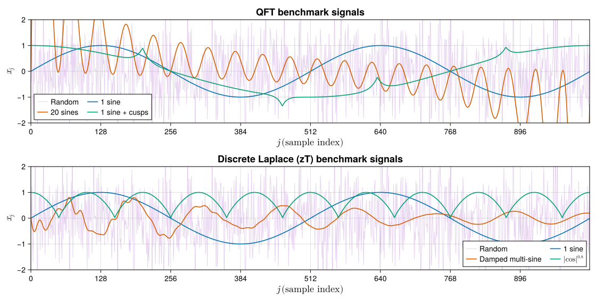
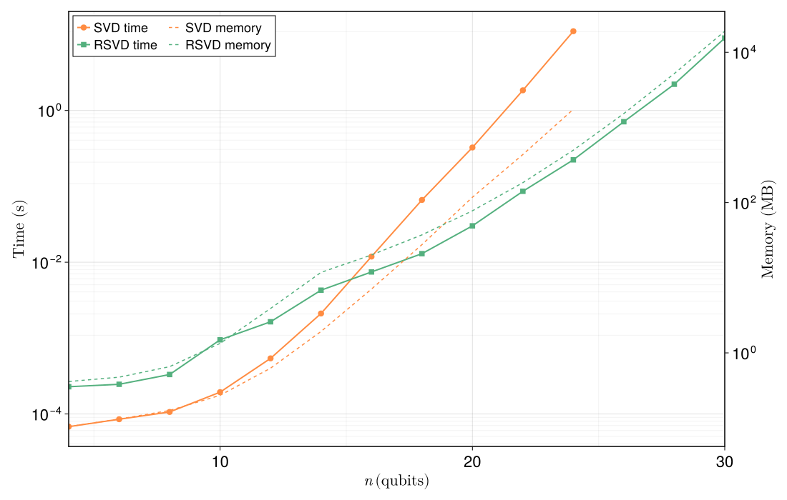
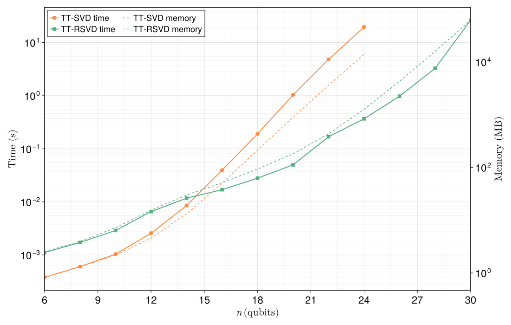
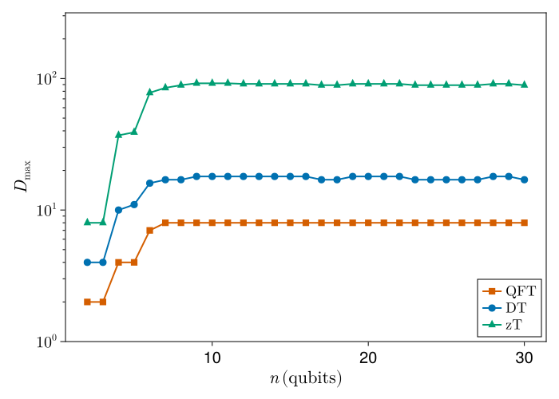
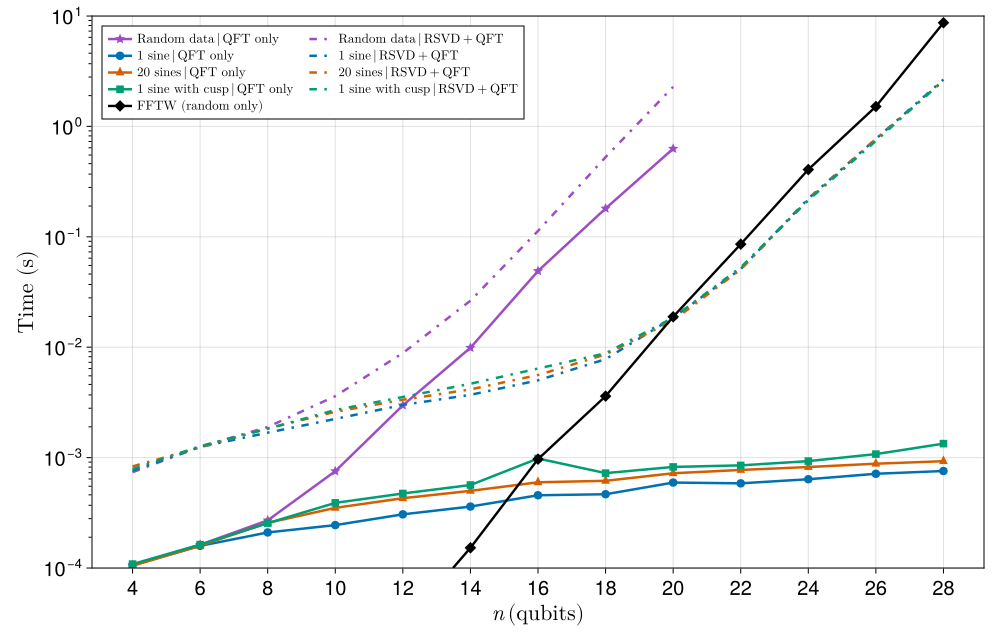
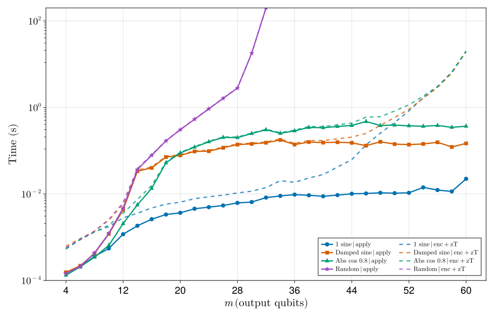

# Benchmarking

This page quantifies where `QILaplace.jl` pays off and where it does not. Every
figure below is produced by a standalone Julia script, run
once on a reference machine. None of it is re-executed during `Documenter`
builds, so the numbers you see are exactly the ones that were measured.

## Methodology

All runs reported here use **Julia `1.11.6`**, `ITensors.jl`, and the default
LinearAlgebra/BLAS stack on an **Apple M2 Max (12 cores, 64 GB RAM)** with
**1 Julia thread** and **8 BLAS threads**. Measurements are collected with
`BenchmarkTools.@benchmark`; each reported point is the *mean* of multiple
samples after a discarded warm-up evaluation. Random tensors and signals use a
fixed RNG seed (`Xoshiro(seed + n)`), so re-runs on the same hardware are
reproducible to within a few percent.


We adopt the notation from the [core concepts](core_concepts.md): a signal of
length $N = 2^n$ lives on $n$ qubits; paired-register operators such as the
discrete Laplace (zT) MPO act on $m = 2n$ output qubits; $\chi_s$ denotes the
signal MPS bond dimension, $\chi_c$ (equivalently $D_{\max}$) denotes the MPO
bond dimension.

### Reproducing these plots locally

Every number on this page can be re-generated on your own machine. All data and
figures live under [scripts/benchmark/](https://github.com/SUTD-MDQS/QILaplace.jl/tree/master/scripts/benchmark),
with a detailed walk-through in
[scripts/benchmark/README.md](https://github.com/SUTD-MDQS/QILaplace.jl/tree/master/scripts/benchmark/README.md).
The short version is:

```bash
julia --project=scripts/benchmark -e 'using Pkg; Pkg.develop(path="."); Pkg.instantiate()'
julia --project=scripts/benchmark scripts/benchmark/<runner>.jl
julia --project=scripts/benchmark scripts/benchmark/plot_<figure>.jl
```

Each runner writes a JLD2 artifact into `scripts/benchmark/results/` and is
**incremental**: re-invoking the script appends missing `n` values to the
existing artifact rather than starting from scratch.

The parameters you are most likely to touch live at the top of each runner:

- `N_RANGE` — the qubit sweep, e.g. `2:1:30`. Shrink this if you only have a
  few minutes; extend it (and raise `TIME_TO_STOP`) to push into the
  memory-bound regime.
- `CUTOFF` — singular-value truncation threshold used for MPS / MPO
  compression. Defaults to `1e-12` for QFT and `1e-15` for zT to match the
  companion paper; looser cutoffs give smaller bond dimensions but larger
  reconstruction error.
- `MAXDIM` — hard cap on any bond dimension that the compressor returns.
- `RSVD_K`, `RSVD_P`, `RSVD_Q` — target rank $k$, oversampling $p$, and power
  iterations $q$ of the randomised SVD (see
  [RSVD notes](tutorials/signal.md)). Structured signals use the global
  `RSVD_K`; for pure random sighal sampled from a Gaussian distribution (`:random`) the runners set
  $k = 2^{\lfloor n/2\rfloor}$, the maximum possible Schmidt rank across the
  middle bipartition, so that bond growth is not artificially capped.
- `TIME_TO_STOP` — per-method wall-clock budget. Once a method exceeds it at
  some `n`, larger `n` are skipped for that method but other methods keep
  going.
- `COMP_METHOD` — single toggle (`:svd` or `:rsvd`) that selects the
  compression backend used inside `signal_mps` / `signal_ztmps`. Flipping this
  and re-running reproduces the “SVD-only” variant of every plot.
- `ZT_BENCH_RANDOM_NS` *(zT runner only)* — environment variable used to
  re-sweep just the `:random` series over a restricted range, e.g.
  `ZT_BENCH_RANDOM_NS=2:16`, without re-running the structured signals.
- `REBENCHMARK` — if set to `true`, clears the in-memory series and
  re-benchmarks from scratch; otherwise the existing artifact is reused.

!!! tip "Reproducibility"
    Raw results (`.jld2`) and figures (`.svg`) are committed to the repository, so you
    can rerun only the plot scripts and still get the same plots. The JLD2 artifacts
    carry a `meta` dict (Julia version, CPU, BLAS threads, parameter values); if you
    change any parameter in the runner the loader detects the mismatch and starts a
    fresh sweep for the affected series.

## 1. Benchmark signals

Before looking at any timing curve it helps to know *what data* we are
encoding. The two runners [`qft_vs_fftw.jl`](https://github.com/SUTD-MDQS/QILaplace.jl/blob/master/scripts/benchmark/qft_vs_fftw.jl)
and [`zt_full_runtime.jl`](https://github.com/SUTD-MDQS/QILaplace.jl/blob/master/scripts/benchmark/zt_full_runtime.jl)
draw their inputs from a small library of signal kinds (`make_signal(kind, n)`
in `scripts/benchmark/common.jl`). Figure 1 shows every family at $n = 10$
($N = 1024$ samples):



**Figure 1.** *Time-domain waveforms of every benchmark signal family at
$n = 10$ ($N = 1024$ samples). Top panel: signals used by the QFT vs. FFTW
benchmark (one sine, twenty sines, one sine with a cusp, and random
data). Bottom panel: signals used by the end-to-end discrete Laplace benchmark
(single sine, damped multi-sine, $|\cos|^{0.8}$, and random data). Structured waveforms are highly compressible and admit small
$\chi_s$; the `:random` signal is the pathological case that saturates the
full Schmidt rank $\chi_s = 2^{n/2}$ at the middle bipartition.*

## 2. Randomised SVD vs. standard SVD

The single most expensive operation in the MPS pipeline is a truncated SVD of
one bipartition of a large tensor. The Quantics representation places that
bipartition at a balanced index split, which is the regime where
[randomised SVD](https://doi.org/10.1137/090771806) delivers its biggest
savings. [`scripts/benchmark/svd_rsvd_itensor.jl`](https://github.com/SUTD-MDQS/QILaplace.jl/blob/master/scripts/benchmark/svd_rsvd_itensor.jl)
takes a single random rank-$n$ ITensor of shape $(2,2,\dots,2)$ with
$N = 2^n$ entries, bipartitions it down the middle, and benchmarks
`ITensors.svd` (the reference deterministic truncated SVD) against
`QILaplace.RSVD.rsvd` (the randomised kernel used throughout the library, with
oversampling $p = 5$, power iterations $q = 2$, and target rank $k = 100$).
Mean wall time (left axis, solid) and mean allocated memory (right axis,
dashed) are shown below.



**Figure 2.** *Kernel-level comparison of deterministic SVD and randomised SVD
on a single middle bipartition of a dense random ITensor of size
$(2,2,\dots,2) = 2^n$.*

Recall from the [core concepts](core_concepts.md) discussion that a dense
truncated SVD of a $2^{n/2} \times 2^{n/2}$ matrix costs $O(N^{3/2}) = O(2^{3n/2})$,
whereas the randomised projector reduces this to $O(k \cdot N) = O(k \cdot 2^n)$
once $k \ll 2^{n/2}$. Below roughly $n \le 14$ this asymptotic picture is
invisible: randomised SVD runs an entire chain of subroutines (draw a Gaussian-random
test matrix, perform $q$ power iterations of matrix-matrix multiplication,
take a QR decomposition, and *then* a small dense SVD of the projected
$k \times k$ block), whereas deterministic SVD executes exactly one LAPACK
call, so the constant-factor overhead of the randomised pipeline dominates.
The two curves cross near $n = 16$, and above that crossover the gap widens
exponentially because the cubic LAPACK cost overtakes all overheads: at
$n = 24$ exact SVD takes **$11.09\,\mathrm{s}$ and allocates $\sim\!1.75\,\mathrm{GB}$**,
while RSVD finishes the same bipartition in **$0.224\,\mathrm{s}$ with
$\sim\!500\,\mathrm{MB}$** of working memory — a $\sim\!50\times$ wall-time
speedup and $\sim\!3.5\times$ memory reduction on a single kernel invocation.
This is exactly the behaviour expected from the two complexity formulas above
and is the reason why `signal_mps` / `signal_ztmps` default to
`method = :rsvd` once the middle bond grows past the crossover.

## 3. MPS conversion of a random signal

Figure 2 timed a *single* bipartition. The workload that actually appears in
practice is the full left-to-right TT sweep performed by `signal_mps`, which
chains $n - 1$ such bipartitions. [`scripts/benchmark/tt_decomp.jl`](https://github.com/SUTD-MDQS/QILaplace.jl/blob/master/scripts/benchmark/tt_decomp.jl)
runs that sweep on a length-$2^n$ random vector — the worst case, because a
random signal has no low-rank structure and saturates every Schmidt
spectrum — with both the `:svd` and `:rsvd` backends, using the same cutoff
and target rank as the single-shot benchmark above. The number of singular vectors(bond dimensions) computed by the RSVD algorithm at each step is $k = 55$.



**Figure 3.** *Full MPS construction (`signal_mps`) on a random
length-$2^n$ signal. Wall time (left axis, solid) and allocated memory (right
axis, dashed) for deterministic SVD and randomised SVD.*

The overall shape of Figure 3 mirrors Figure 2: the total cost is a constant
times the cost of the dominant middle bipartition, consistent with the
$O(n \chi^3)$ TT-sweep runtime recalled in the
[core concepts](core_concepts.md) page (for random data the bond at site $i$
scales as $\chi_i = \min(2^i, 2^{n-i})$, and the middle bond dominates). The
qualitative difference lies in the bond dimension: deterministic SVD allows
$\chi$ to grow to its full Schmidt value $2^{n/2}$, which at $n = 20$ already
means $\chi = 1024$, so the SVD TT sweep pays the cubic cost of an
uncompressible state. Randomised SVD, by contrast, is *intrinsically
rank-capped*, returning at most $k$ singular values by construction. At $n = 24$
this manifests as **$19.67\,\mathrm{s}$ and $\sim\!14\,\mathrm{GB}$ of
allocations** for `signal_mps(:svd)` versus **$0.37\,\mathrm{s}$ and
$\sim\!1.3\,\mathrm{GB}$** for `signal_mps(:rsvd)`: a $\sim\!50\times$ wall-time
and $\sim\!11\times$ memory improvement. The RSVD speed-up is not free
accuracy. MPS data generated by SVD *has* full rank, whereas the RSVD produces a rank-$k$ cap that results in a lossy compression.

## 4. MPO bond dimension scaling: QFT, DT, zT

Once we have an MPS encoding of the input, the rest of the transform is
contracting it with a precompiled MPO. 
For every figure henceforth, we separate two classes of cost:

- **Core compute** — time spent inside the dominant kernel (e.g. `apply(W, ψ)`,
  a single SVD, a full TT sweep).
- **End-to-end** — core compute **plus** the time required to prepare the input
  MPS from a dense vector via `signal_mps` / `signal_ztmps`. Building MPOs is
  treated as a one-time setup cost and is **excluded from timed regions**.

The runtime formula for `apply(W, ψ)`
quoted throughout this package,

```math
T_{\text{apply}} \;=\; O\!\left(n\, \chi_c^{\,2}\, \chi_s^{\,2}\right)
\;=\; O\!\left(\chi_s^{\,2}\, \log N\right)
\quad\text{for fixed circuit transform accuracy},
```

is only as good as the claim that the circuit bond dimension $\chi_c$ (the
MPO's $D_{\max}$) is bounded independently of $n$. For generic circuits this
claim may not hold. What makes QFT, DT, and zT tractable is fact that their singular values decay exponentially at every bond, and the specific
compression procedure described in the [core concepts](core_concepts.md) page that we use to arrive at the final MPO.
Each transform is expressed as a layered circuit whose gates are **zipped
into an MPO** one layer at a time, and between layers we bring the partially combined
MPO into a **mixed canonical form** via QR decompositions and truncate via SVD at every bond. Because
each truncation is performed on a locally orthogonal tensor, the discarded
singular values produce a provable local error bound, but optimized globally. As a consequence, the transform
MPOs bond dimensions saturate for all the three circuits constructed as such.

We plot against the **input qubit count** $n$ for the
single-register QFT and for the paired-register DT and zT operators.



**Figure 4.** *Maximum bond dimension $D_{\max}$ of the compressed MPO as a
function of the number of input qubits $n$, at a truncation cutoff of
$10^{-15}$. Single-register QFT has output qubits $m = n$; paired-register DT and zT have
$m = 2n$.*

All three curves plateau. The QFT MPO saturates at $D_{\max} = 8$ for
$m \ge 8$, reproducing the QFT result of
[Chen, Stoudenmire and White (2023)](https://arxiv.org/abs/2210.08468). The
Damping-Transform MPO saturates around $D_{\max} \approx 17\text{--}18$. The
DT mixes two registers and is non-unitary, so its bond budget is a few times
larger than QFT, but it is still a constant. The discrete Laplace MPO is
the hardest of the three and saturates at $D_{\max} \approx 89\text{--}92$
from $m \gtrsim 18$ onwards; this is much larger than QFT or DT, but it is
still $O(1)$ and not $O(2^{m/2})$, so it still becomes flat on the log-scale plot.
Because all three $D_{\max}$ values are bounded, for any signal whose MPS is
well represented in a finite $\chi_s$ the transform runtime is
$O(\chi_s^{\,2} \log N)$, i.e. **logarithmic** in the dense problem size $N$.

## 5. End-to-end QFT vs. FFTW

With $D_{\max}$ bounded, the end-to-end QFT time on a compressible signal is
set by two pieces: (i) RSVD-based MPS compression of the dense input, and
(ii) MPO application once that MPS is available. Following the scaling analysis
reported by Chen _et al._, if the maximum MPS bond is $\chi_m$,
the **full** RSVD compression sweep scales as
```math
T_{\mathrm{compress}} = O\!\left(\chi_m N + \chi_m^2 \sqrt{N}\right).
```
The dominant $\chi_m N$ term comes from the central-bond randomized projection
(a $\sqrt{N}\times\sqrt{N}$ data matrix multiplied by a
$\sqrt{N}\times\chi_m'$ random test matrix, with $\chi_m' - \chi_m \sim 5$--$10$),
while the $\chi_m^2\sqrt{N}$ term is the subsequent small SVD/orthogonalization
cost. Moving away from the center, the decomposed matrices shrink
($\sqrt{N}/2 \times 2\chi_m$, $\sqrt{N}/4 \times 2\chi_m$, etc.), which changes
the prefactor but not the asymptotic form above. For bounded $\chi_m$, this is
$O(N)=O(2^n)$ for input compression. The apply stage then contributes
$O(n\chi_c^2\chi_s^2)=O(\chi_s^2\log N)$ with bounded $\chi_c$. The honest
comparison against a dense FFT must include the encoding cost, because
`FFTW.fft` already operates on a dense array. [scripts/benchmark/qft_vs_fftw.jl](https://github.com/SUTD-MDQS/QILaplace.jl/blob/master/scripts/benchmark/qft_vs_fftw.jl)
does this for four signal families at fixed `cutoff = 1e-12` and plots QFT
only (`apply(W, ψ)` with a pre-built MPS, solid), RSVD encoding + QFT
(`signal_mps(:rsvd)` followed by `apply`, dash-dotted), and the FFTW baseline
on the random signal (black diamonds).



**Figure 5.** *End-to-end QFT runtime vs. FFTW. Solid curves: `apply(W, ψ)`
with a pre-built MPS (QFT-only step). Dash-dotted curves: full pipeline,
`signal_mps(:rsvd)` + `apply`. Black diamonds: FFTW `fft` on the random
signal, shown once as the dense baseline. Vertical axis is log-scale.

For **compressible** inputs (`:sin`, `:sine20`, `:sin_cusp`) the QFT-only
solid curves are essentially flat on this log-scale plot: the MPS has a
$\chi_s$ that stops growing at a few tens, $D_{\max}$ plateaus at $8$, and
the resulting $O(\chi_s^2 \log N)$ scaling is straight-line logarithmic. At
$n = 28$ (i.e. $N = 2^{28} \approx 2.7 \times 10^8$ samples) the QFT-only
apply costs roughly $0.8\,\mathrm{ms}$ on the single sine, and the full
RSVD+QFT pipeline costs $\sim\!2.7\,\mathrm{s}$ — three orders of magnitude
below the $\sim\!8.7\,\mathrm{s}$ that FFTW needs on a dense length-$2^{28}$
array. This reproduces the asymptotic advantage reported by
[Chen, Stoudenmire and White (2023)](https://arxiv.org/abs/2210.08468): with
bounded $\chi_s$, the RSVD-MPS compression front-end is $O(N)$ and the QFT
apply back-end is $O(\log N)$, so the end-to-end trend is dominated by the
near-linear encoding stage and can still asymptotically outperform FFTW's
$O(N \log N)$ scaling at large enough $N$.
Relative to their implementation, our apply kernel is *faster* (we perform
raw tensor contractions through the precompiled MPO without
compression inside `apply`) while our RSVD$\rightarrow$MPS conversion is
*slower*.

The **random** signal tells the complementary story. Because a random
vector has no low-rank structure, its MPS needs $\chi_s = 2^{n/2}$, which
turns $O(\chi_s^2 \log N)$ into $O(N \log N)$ and erases the logarithmic
advantage. The `:random` curves track FFTW's slope rather than the other
QFT-only curves, and the RSVD+QFT variant is *worse* than FFTW on this
family because we additionally pay the TT-sweep cost. We report this case
explicitly: the asymptotic logarithmic scaling is a statement about
*structured* signals, and the algorithm does not outperform FFTW
on purely unstructured data.

## 6. End-to-end discrete Laplace (zT) transform

The discrete Laplace transform has no FFTW counterpart. The benchmark script
[scripts/benchmark/zt_full_runtime.jl](https://github.com/SUTD-MDQS/QILaplace.jl/blob/master/scripts/benchmark/zt_full_runtime.jl)
follows the same layout as `qft_vs_fftw.jl`: for each input qubit
count `n` and each signal kind it builds a paired-register MPS with
`signal_ztmps`, forms `W = build_zt_mpo(ψ, ω_r)` **outside** the timed
encoding region, then benchmarks (i) `signal_ztmps` alone and (ii)
`apply(W, ψ)` on the same `(ψ, W)` instance (with a dry-run apply before the
timed samples). For the `:random` signal we set the RSVD target rank to
$k = 2^{\lfloor n/2\rfloor}$ so that bond growth is not artificially capped.



**Figure 6.** *End-to-end discrete Laplace pipeline runtime. Solid curves:
apply only with a pre-built MPS. Dashed curves: encoding +
apply. Horizontal axis is the output
qubit count $m = 2n$; vertical axis is log-scale. The random series stops
at $m = 32$ because it hits both the time budget and the machine's memory
ceiling.*

On the structured kinds, `:sin`, `:multi_sin_exp`, `:abs_cos_power_p8`, the behavior matches the asymptotic $O(\chi_s^2 \log N)$ trend. The apply part is nearly flat with growing $n$. The total cost is mostly from encoding. At $m = 60$, the measured totals are $20.036\,\mathrm{s}$ for `:sin`, $19.745\,\mathrm{s}$ for `:multi_sin_exp`, and $19.782\,\mathrm{s}$ for `:abs_cos_power_p8`. These times include encoding and apply.

The `:random` series shows two regimes. From $m = 16$ to $m = 28$, the curve is close to linear on the log scale and this matches the expected $O(N)$ trend for this range. Then the curve jumps sharply near $m = 32$. The memory data supports this explanation. The apply allocation is about $0.50\,\mathrm{GB}$ at $m = 16$, $2.28\,\mathrm{GB}$ at $m = 20$, $9.24\,\mathrm{GB}$ at $m = 24$, and $34.80\,\mathrm{GB}$ at $m = 28$. At the next point the run enters the pager regime, data no longer stays fully in RAM, and runtime rises very fast. This jump is therefore not only algorithmic, it is also a hardware memory limit effect on a desktop laptop. On an HPC system with larger RAM, this regime can be delayed and the smooth pre pager trend can continue to larger $m$. Nevertheless, the runtime complexity of our transform on a random signal obtained from the slope of the linear regime, $O(N)$, is still better than the classically known algorithms such as the Chirp-z transform that performs the same complex z-transform at $O((N+M)\log(N+M))$ with $N=2^n$, $M=N^2$.

## Summary

| Figure | Claim | Evidence |
|:---|:---|:---|
| §1 | Benchmark signals span a spectrum from single-frequency sines to pure Gaussian noise | Time-domain plot at $n = 10$ |
| §2 | RSVD beats SVD above the crossover near $n \approx 16$ on a single middle bipartition | $\sim\!50\times$ faster and $\sim\!3.5\times$ less memory at $n = 24$ |
| §3 | `signal_mps(:rsvd)` is the right default on hard, high-rank inputs | $\sim\!50\times$ faster *and* bond dimension capped at $\chi \le k$ on random data |
| §4 | QFT, DT, zT MPOs all plateau in $D_{\max}$ | $D_{\max}(\mathrm{QFT}) = 8$, $D_{\max}(\mathrm{DT}) \approx 17$, $D_{\max}(\mathrm{zT}) \approx 90$ |
| §5 | On compressible signals, end-to-end QFT scales logarithmically in $N$ and overtakes FFTW asymptotically | $\sim\!0.8\,\mathrm{ms}$ QFT-only at $n = 28$ vs. $\sim\!8.7\,\mathrm{s}$ FFTW; `:random` tracks FFTW as expected |
| §6 | zT pipeline stays practical on structured signals up to $m = 60$, `:random` is first close to $O(N)$, then memory bound | At $m = 60$, total time is $20.036\,\mathrm{s}$ for `:sin`, $19.745\,\mathrm{s}$ for `:multi_sin_exp`, and $19.782\,\mathrm{s}$ for `:abs_cos_power_p8`, for `:random` apply allocation grows from $0.50\,\mathrm{GB}$ at $m = 16$ to $34.80\,\mathrm{GB}$ at $m = 28$, then the run hits pager limits near $m = 30$ |

All six runners support incremental runs: extend `N_RANGE`, raise
`TIME_TO_STOP`, flip `COMP_METHOD`, or re-sweep one signal kind with
`ZT_BENCH_RANDOM_NS`, and the previously-collected data points are preserved.
