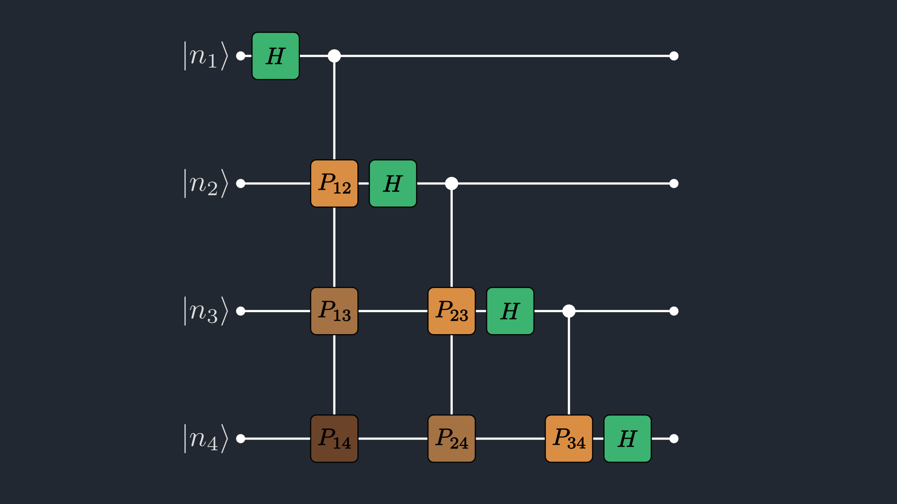

```@meta
EditURL = "dft.jl"
```

# Discrete Fourier Transform Tutorial

This walkthrough shows how to use `QILaplace.jl` to compute the DFT.

The Quantum Fourier Transform (QFT) is the unitary transform underlying several
quantum algorithms. In modern form it was formalized in early quantum computing
work (notably Coppersmith, 1994) and popularized by Shor's factoring algorithm.
In this tutorial, we use the same linear map on a *classical* tensor-network state.

For a register of $n$ qubits ($N = 2^n$ basis states), the QFT is defined by

```math
\mathrm{QFT}_N\,|x\rangle = \frac{1}{\sqrt{N}}\sum_{k=0}^{N-1}
e^{2\pi ixk/N}|k\rangle,
```

where $x,k\in\{0,\dots,N-1\}$ and $|x\rangle$ denotes the computational basis
state corresponding to the binary encoding of index $x$: $|x\rangle = |x_1x_2\dots x_n\rangle$.

In `QILaplace.jl`, we first encode a length-$N$ signal into an MPS,
$\sum_{x=0}^{N-1} a_x |x\rangle$, then apply a compressed QFT MPO built from
Hadamard and controlled-phase gates.



*Figure 1. Four-qubit QFT circuit in product form: Each wire receives a Hadamard gate followed by controlled-phase gates ($P_{ij}$) from less significant wires. The unswapped output is in bit-reversed order.*

In the product-form circuit, outputs come out in **bit-reversed order** relative
to standard DFT indexing: if $k = k_{n-1}\dots k_1k_0$, the unswapped output is
indexed by $\operatorname{rev}(k)=k_0k_1\dots k_{n-1}$.

This is why we either (i) append explicit SWAP gates at the end of the QFT
circuit, (ii) sample the MPS by keeping the bit-reversed ordering in mind, or
(iii) account for reversal when converting the transformed MPS to a dense
vector for comparison with FFT-based reference implementations.

In this QFT circuit, the Hadamard Gate ($H$) and the Phase gate ($P_{ij}$) are defined as:
```math
H = \frac{1}{\sqrt{2}} \begin{pmatrix} 1 & 1 \\ 1 & -1 \end{pmatrix} \quad
P_{ij} = \begin{pmatrix} 1 & 0 \\ 0 & e^{2\pi i / 2^{j-i+1}} \end{pmatrix}
```
Controlled-phase action:
- If the control qubit is $|0\rangle$, nothing happens to the target.
- If the control qubit is $|1\rangle$, the target picks up the phase defined by $P_{ij}$.

````julia
using QILaplace, ITensors
using FFTW, LinearAlgebra
````

## Setting up the signal
Create a $2^n$-point signal (here $n=4$, so $N=16$):

````julia
n = 4
N = 2^n
dt = 1 / N
x = generate_signal(n, kind=:sin, dt=dt, freq=2π)
````

````
16-element Vector{Float64}:
  0.0
  0.3826834323650898
  0.7071067811865475
  0.9238795325112867
  1.0
  0.9238795325112867
  0.7071067811865476
  0.3826834323650899
  1.2246467991473532e-16
 -0.38268343236508967
 -0.7071067811865475
 -0.9238795325112865
 -1.0
 -0.9238795325112866
 -0.7071067811865477
 -0.3826834323650904
````

## Constructing the SignalMPS

````julia
sites = [Index(2, "site-$i") for i in 1:n]
psi_test, x_norm = signal_mps(x)
````

````
(SignalMPS with 4 sites:
  Site 1: dim=2, tags="site-1" | dim=1, tags="bond-1"
  Site 2: dim=1, tags="bond-1" | dim=2, tags="site-2" | dim=2, tags="bond-2"
  Site 3: dim=2, tags="bond-2" | dim=2, tags="site-3" | dim=2, tags="bond-3"
  Site 4: dim=2, tags="bond-3" | dim=2, tags="site-4"
, 2.8284271247461903)
````

Coefficient-level validation and signal-compression diagnostics are now covered
in the dedicated `signal.jl` tutorial so that this page stays focused on DFT/QFT.

## Constructing the QFT circuit

````julia
qft_mpo = build_qft_mpo(psi_test; cutoff=1e-14, maxdim=100)
````

````
SingleSiteMPO with 4 sites:
  Site 1: dim=2, tags="site-1" | dim=2, tags="site-1" | dim=2, tags="bond-1"
  Site 2: dim=2, tags="site-2" | dim=2, tags="site-2" | dim=2, tags="bond-1" | dim=4, tags="bond-2"
  Site 3: dim=2, tags="site-3" | dim=2, tags="site-3" | dim=4, tags="bond-2" | dim=2, tags="bond-3"
  Site 4: dim=2, tags="site-4" | dim=2, tags="site-4" | dim=2, tags="bond-3"

````

Ensure MPS and MPO use exactly the same site indices before applying.


````
true
````

## Performing the Fourier Transform

````julia
psi_qn = apply(qft_mpo, psi_test)
````

````
SignalMPS with 4 sites:
  Site 1: dim=2, tags="site-1" | dim=2, tags="bond-1"
  Site 2: dim=2, tags="bond-1" | dim=2, tags="site-2" | dim=8, tags="bond-2"
  Site 3: dim=8, tags="bond-2" | dim=2, tags="site-3" | dim=4, tags="bond-3"
  Site 4: dim=4, tags="bond-3" | dim=2, tags="site-4"

````

You can also simply multiply the QFT MPO with the SignalMPS using `qft_mpo * psi_test`.

To compare the results of our transform, we use `FFTW.jl` as the reference to verify our transform results.
FFTW conventions are:

```math
\mathrm{fft}(x)_k = \sum_{x=0}^{N-1} x_x\,e^{-2\pi i xk/N},
\qquad
\mathrm{bfft}(x)_k = \sum_{x=0}^{N-1} x_x\,e^{+2\pi i xk/N}.
```

Our QFT convention uses the $+2\pi i$ phase and includes $1/\sqrt{N}$, so for
normalized input $\hat{x}=x/\|x\|_2$ we expect

```math
\mathrm{QFT}_N\hat{x} = \frac{\mathrm{bfft}(\hat{x})}{\sqrt{N}}.
```

We now need a helper that contracts a `SignalMPS` back to a dense vector. The
option `rev=true` applies output-index bit reversal, so the returned vector is
in the usual DFT ordering.


````
bitreverse_int (generic function with 1 method)
````

````julia


````

`mps_to_vector` is practical for small to moderate $n$ and debugging. For very
large systems, dense reconstruction is exponentially expensive in memory/time.
We recommend sampling the spectrum directly from the MPS form in such cases.

Next we compare QILaplace output with FFTW and sample a few indices.

````julia
N = length(x)
x_hat = x / x_norm

qft_qn = mps_to_vector(psi_qn; rev=false)
qft_fn = mps_to_vector(psi_qn; rev=true)
fftw_ref = bfft(x_hat) / sqrt(N)

println("\nQFT coefficients in circuit order (unswapped):")
println(round.(qft_qn; digits=5))

println("\nQFT coefficients in FFT order (bit-reversed):")
println(round.(qft_fn; digits=5))

comparison_error = norm(qft_fn - fftw_ref)
@show comparison_error
````

````
1.2123008147487333e-15
````

Explicit sampling for k = 1 and k = 7.
n=4:
- k=1  -> binary 0001 -> reversed 1000 -> index 8 in 0-based -> 9 in Julia.
- k=7  -> binary 0111 -> reversed 1110 -> index 14 in 0-based -> 15 in Julia.

````julia
k1 = 1
idx_fn_k1 = k1 + 1
idx_qn_k1 = 9
qft_val_k1 = round(qft_qn[idx_qn_k1]; digits=5)
fftw_val_k1 = round(fftw_ref[idx_fn_k1]; digits=5)
@show k1 qft_val_k1 fftw_val_k1 abs(qft_val_k1 - fftw_val_k1)

k2 = 7
idx_fn_k2 = k2 + 1
idx_qn_k2 = 15
qft_val_k2 = round(qft_qn[idx_qn_k2]; digits=5)
fftw_val_k2 = round(fftw_ref[idx_fn_k2]; digits=5)
@show k2 qft_val_k2 fftw_val_k2 abs(qft_val_k2 - fftw_val_k2)


# Analysing the Fourier Spectrum
````

````
0.0
````

For a moderately larger signal, we compare the QFT spectrum against FFTW and plot the
absolute error on a secondary (right) y-axis with a distinct linestyle. We choose a signal with two
sinusoids with frequencies $\omega_1 = 8.35$ and $\omega_2 = 43.70$ and phases $\phi_1 = 0$ and $\phi_2 = 0.3$.
We deliberately choose the frequencies to not be an integer multiple of $2\pi/N$ so that we have a non-zero DC value,
and the frequency peaks are not too sharp in the fourier domain.

````julia
using Plots, LaTeXStrings

n_big = 8
N_big = 2^n_big
dt_big = 1 / N_big
freq_big = 2π .* [8.35, 43.70]
phase_big = [0.0, 0.3]
x_big = generate_signal(n_big, kind=:sin, dt=dt_big, freq=freq_big, phase=phase_big)
psi_big, x_big_norm = signal_mps(x_big)

qft_big_mpo = build_qft_mpo(psi_big; cutoff=1e-12, maxdim=1000)
psi_big_qn = apply(qft_big_mpo, psi_big)

qft_big = mps_to_vector(psi_big_qn; rev=true)
fftw_big = bfft(x_big / x_big_norm) / sqrt(length(x_big))
abs_err_big = abs.(qft_big .- fftw_big)

N_big = length(x_big)
````

````
256
````

For this generated signal, we can predict where peaks should appear, and what the DC value $(at \omega=0$) is analytically.

The signal generator uses

```math
x_j = \sum_r \sin(\Omega_r j + \phi_r),\quad \Omega_r = \omega_r\,dt,
```

and here we explicitly choose

```math
dt = \frac{1}{N}.
```

With `freq=[2π*8.35,\,2π*43.70]`, `phase=[0,0.3]`, and `N=256`, we get

```math
\Omega_1 = \frac{2π*8.35}{256},\qquad \Omega_2 = \frac{2π*43.70}{256},
```

i.e. numerically

```math
\Omega_1\approx 0.330,\qquad \Omega_2\approx 1.748,
```

So the spectrum should show symmetric peaks near
$\omega\approx\pm\Omega_1$ and $\omega\approx\pm\Omega_2$.

The DC value (at $\omega=0$) for the normalized transform
$\mathrm{bfft}(x/\|x\|_2)/\sqrt{N}$ equals

```math
X(0) = \frac{1}{\sqrt{N}\,\|x\|_2}\sum_{j=0}^{N-1}x_j.
```

For each sinusoid, the finite sum is

```math
S(\Omega,\phi)=\sum_{j=0}^{N-1}\sin(\Omega j+\phi)
=\frac{\sin\!\left(\frac{N\Omega}{2}\right)
\sin\!\left(\phi+\frac{(N-1)\Omega}{2}\right)}{\sin\!\left(\frac{\Omega}{2}\right)}.
```

````julia
Ω_big = freq_big .* dt_big

@show Ω_big Ω_big ./ π

function sine_sum_closed_form(Ω::Real, ϕ::Real, N::Int)
	return sin(N * Ω / 2) * sin(ϕ + (N - 1) * Ω / 2) / sin(Ω / 2)
end

dc_pred = sum(sine_sum_closed_form(Ω, ϕ, N_big) for (Ω, ϕ) in zip(Ω_big, phase_big)) / (x_big_norm * sqrt(N_big))


ω_axis = (2π / N_big) .* collect(-div(N_big, 2):(div(N_big, 2) - 1))
````

````
Ω_big = [0.20493983326152165, 1.0725593668896405]
Ω_big ./ π = [0.065234375, 0.3414062500000001]

````


````julia

zero_idx = findfirst(==(0.0), ω_axis)
dc_numeric = isnothing(zero_idx) ? NaN + NaN * im : fftw_big_shift[zero_idx]
@show dc_pred dc_numeric abs(dc_pred - dc_numeric)
````

````
9.020562075079397e-17
````

The generated spectrum comparison plot is embedded below.

```@raw html

```

*Figure 2. Shifted spectrum comparison in angular frequency $\omega\in[-\pi,\pi)$ for $n=8$: the QILaplace QFT and FFTW reference overlap at the expected peak locations near $\omega\approx\pm\Omega_1$ and $\omega\approx\pm\Omega_2$ (vertical dash-dot markers), while the dotted error curve (right axis) remains small throughout the band.*

Currently we don't have the inverse QFT available in `QILaplace.jl`, but it is straightforward to implement since QFT is a unitary, hence invertible transform. If you want this support as well, feel free to leave a request in our [main GutHub repo](https://github.com/SUTD-MDQS/QILaplace.jl/issues) :)

---

*This page was generated using [Literate.jl](https://github.com/fredrikekre/Literate.jl).*

