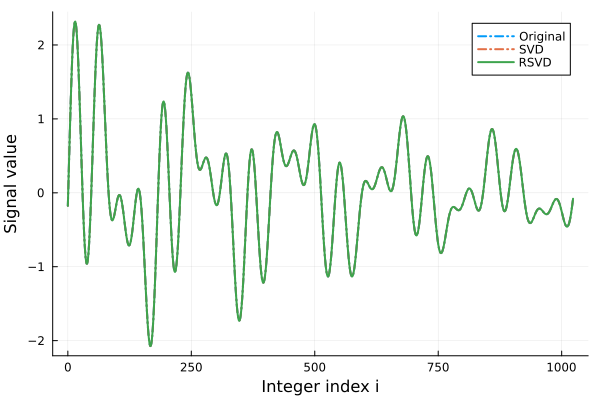
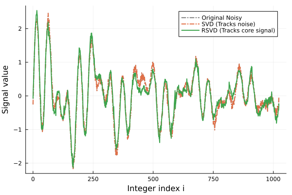

```@meta
EditURL = "signal.jl"
```

# Signal Encoding and Compression

This tutorial focuses on building an intuition for how classical signals map onto Matrix Product States (MPS) and how to interact with the compressed data.

We will use `n` to denote the number of qubits (or sites), giving us a total
signal length of `N = 2^n`.

````julia
using QILaplace, ITensors
````

## 1. Defining a Structured Signal

Let's start by generating a simple, smooth signal. Structured signals like sine waves or smooth decays have low "entanglement" across our `n` qubits.
This mathematical property is exactly what allows us to compress them so efficiently!

We will use a small signal with n=4 qubits (16 elements total).

````julia
n = 4
N = 2^n
x_structured = generate_signal(n, kind=:sin, freq=[1.0, 3.0], phase=[0.2, -0.4])
````

````
16-element Vector{Float64}:
 -0.1907490115135893
  1.583146970344883
  1.3375155615167753
  0.059005583838356745
  0.3600095461044126
  1.2390415955021288
  0.19074901151358986
 -1.5831469703448826
 -1.337515561516776
 -0.059005583838356856
 -0.3600095461044127
 -1.2390415955021288
 -0.1907490115135887
  1.5831469703448833
  1.3375155615167746
  0.0590055838383573
````

Now, we compress this signal into an MPS. The `signal_mps` function returns
the normalized MPS `psi` and the original vector's norm, which we need to recover the exact physical values later.

````julia

psi, x_norm = signal_mps(x_structured; method=:svd, cutoff=1e-14)
````

````
(SignalMPS with 4 sites:
  Site 1: dim=2, tags="site-1" | dim=2, tags="bond-1"
  Site 2: dim=2, tags="bond-1" | dim=2, tags="site-2" | dim=3, tags="bond-2"
  Site 3: dim=3, tags="bond-2" | dim=2, tags="site-3" | dim=2, tags="bond-3"
  Site 4: dim=2, tags="bond-3" | dim=2, tags="site-4"
, 4.041678989149093)
````

## 2. Accessing the Compressed Elements

Now that our signal is compressed, how do we read it?

The elements of our original signal array map directly to the coefficients
of the MPS basis states. We can access these values from a few different
intuitive perspectives.

Let's say we want to look at the 10th element of our original signal.
In Julia's 1-based indexing, this is `x_structured[10]`.

As a 0-based integer, this corresponds to index 9.
In binary, 9 is `1001`.

````julia
target_idx = 9
binary_state = [1, 0, 0, 1]
````

````
4-element Vector{Int64}:
 1
 0
 0
 1
````

Here is how we can extract that exact value from our MPS `psi`:

**Method A: Integer Indexing**.
We can ask for the coefficient directly using the integer index.

````julia
val_int = x_norm * coefficient(psi, target_idx);
````

**Method B: Binary Array Indexing**.
We can pass the bit array representing the specific basis state.

````julia
val_bin = x_norm * coefficient(psi, binary_state);
````

**Method C: Direct Array-Like Access**.
For a more native feel, we can index the MPS directly using the bit states.

````julia
val_direct = x_norm * psi[1, 0, 0, 1];
````

Let's verify that all these methods return the exact same physical value as our original uncompressed array:

````julia
println("Original signal value: ", x_structured[target_idx+1])
println("Integer access:        ", val_int)
println("Binary array access:   ", val_bin)
println("Direct state access:   ", val_direct)

````

````
Original signal value: -0.059005583838356856
Integer access:        -0.05900558383835625
Binary array access:   -0.05900558383835625
Direct state access:   -0.05900558383835625

````

## 3. Compression Strategies: SVD vs. RSVD

To compress our signal into an MPS, we need a way to truncate the
tensor network. This package provides two primary methods, and
choosing between them depends heavily on the nature of your signal.

**Singular Value Decomposition (SVD)** is the gold standard for fidelity.
Because it computes the full singular spectrum, it provides a strict
theoretical error guarantee upon truncation. However, this precision comes
with a catch: if your signal contains random noise, SVD will faithfully
try to capture that noise. In the language of tensor networks, noise
looks like high entanglement, which drastically inflates your bond dimensions.

**Randomized SVD (RSVD)** takes a more pragmatic approach. Instead of
computing the entire singular spectrum, it uses randomized algorithms to
capture only the first `k` singular values. By skipping the full computation,
it safely ignores much of the "noisy" spectrum, compressing the data into an
MPS much faster.

*(For more comparison on these tensor decompositions, check out
the [Core Concepts](../core_concepts.md)).*

**The general rule of thumb:**
- Use **SVD** when your data is small, or when you need predictable, guaranteed accuracy on clean data.
- Use **RSVD** when your data is huge, or when dealing with noisy signals where full spectrum calculation is wasteful.

Let's define a couple of helper functions and test both methods on a larger,
structured signal with n=10 qubits (1024 elements).

````julia
max_bond_dim(psi) = isempty(psi.bonds) ? 1 : maximum(dim.(psi.bonds))
relative_l2(x_hat, x_ref) = norm(x_hat - x_ref) / max(norm(x_ref), eps(Float64))
````

````
relative_l2 (generic function with 1 method)
````

Generate a decaying multi-frequency signal

````julia
n_struct = 10
N_struct = 2^n_struct

x_structured = generate_signal(
    n_struct,
    kind=:sin_decay,
    freq=[2.0, 5.0, 13.0],
    decay_rate=[0.03, 0.05, 0.08],
    phase=[0.0, 0.4, -0.6],
)

cutoff = 1e-9
maxdim = 96;
````

Compress using exact SVD

````julia
t_svd = @elapsed psi_svd, norm_svd = signal_mps(
    x_structured; method=:svd, cutoff=cutoff, maxdim=maxdim
);
````

Compress using Randomized SVD (targeting the top k=10 singular values)

````julia
t_rsvd = @elapsed psi_rsvd, norm_rsvd = signal_mps(
    x_structured; method=:rsvd, cutoff=cutoff, maxdim=maxdim, k=10
);
````

## 4. Evaluating the Structured Signal

Let's reconstruct both compressed states back into standard arrays and
compare their performance. Because our signal is highly structured (smooth
sine waves and decays), we expect both methods to perform exceptionally well.

````julia
x_struct_svd = [norm_svd * coefficient(psi_svd, i) for i in 0:(N_struct-1)]
x_struct_rsvd = [norm_rsvd * coefficient(psi_rsvd, i) for i in 0:(N_struct-1)]

println("SVD Performance:")
println("  Time:       ", round(t_svd, digits=4), " seconds")
println("  Max Bond:   ", max_bond_dim(psi_svd))
println("  Rel Error:  ", round(relative_l2(x_struct_svd, x_structured), sigdigits=3))
println("\nRSVD Performance:")
println("  Time:       ", round(t_rsvd, digits=4), " seconds")
println("  Max Bond:   ", max_bond_dim(psi_rsvd))
println("  Rel Error:  ", round(relative_l2(x_struct_rsvd, x_structured), sigdigits=3))
````

````
SVD Performance:
  Time:       12.4462 seconds
  Max Bond:   6
  Rel Error:  5.91e-15

RSVD Performance:
  Time:       3.4352 seconds
  Max Bond:   6
  Rel Error:  1.09e-13

````

Both algorithms captured the structure perfectly, but let's visualize
the reconstruction to be sure.


```@raw html

```

*Figure 1: Both SVD and RSVD accurately track the original structured signal.*

## 5. The Noisy Signal Experiment

Now we reach the critical difference between these two methods. Real-world
signals are rarely perfectly smooth; they contain noise.

Let's add 10% Gaussian noise to our structured signal.

When we ask **SVD** to compress this, it will faithfully try to capture
every single random fluctuation. Because noise lacks underlying structure,
the "entanglement" of the state skyrockets, causing the bond dimensions
to blow up rapidly to satisfy our strict `cutoff` tolerance.

**RSVD**, on the other hand, is given a strict budget (`maxdim=10` and `k=10`).
It cannot perfectly recreate the noise. Instead, it captures the dominant
features (the underlying sine waves and decays) and essentially discards
the rest. While its mathematical error compared to the raw noisy signal
will be higher, it successfully extracts the meaningful data without
exploding the bond dimension!

````julia
import Random.Xoshiro, Random.randn
import Statistics.std

rng = Xoshiro(2026)
noise_sigma = 0.1 * std(x_structured)
x_noisy = x_structured .+ noise_sigma .* randn(rng, length(x_structured));
````

We run SVD with ONLY our strict error cutoff. It will do whatever it takes
to hit that accuracy.

````julia
t_svd_noisy = @elapsed psi_svd_noisy, norm_svd_noisy = signal_mps(
    x_noisy; method=:svd, cutoff=cutoff
);
````

We run RSVD with a strict bond dimension limit.

````julia
t_rsvd_noisy = @elapsed psi_rsvd_noisy, norm_rsvd_noisy = signal_mps(
    x_noisy; method=:rsvd, cutoff=cutoff, maxdim=10, k=10
);
````

Let's reconstruct the signals and compare the metrics:

````julia
N_struct = length(x_noisy)
x_noisy_svd = [norm_svd_noisy * coefficient(psi_svd_noisy, i) for i in 0:(N_struct-1)]
x_noisy_rsvd = [norm_rsvd_noisy * coefficient(psi_rsvd_noisy, i) for i in 0:(N_struct-1)]

err_noisy_svd = relative_l2(x_noisy_svd, x_noisy)
err_noisy_rsvd = relative_l2(x_noisy_rsvd, x_noisy)

bond_noisy_svd = max_bond_dim(psi_svd_noisy)
bond_noisy_rsvd = max_bond_dim(psi_rsvd_noisy)

println("Noisy SVD Performance:")
println("  Time:       ", round(t_svd_noisy, digits=4), " seconds")
println("  Max Bond:   ", bond_noisy_svd, " (Massive blow-up!)")
println("  Rel Error:  ", round(err_noisy_svd, sigdigits=3))
println("\nNoisy RSVD Performance:")
println("  Time:       ", round(t_rsvd_noisy, digits=4), " seconds")
println("  Max Bond:   ", bond_noisy_rsvd, " (Constrained)")
println("  Rel Error:  ", round(err_noisy_rsvd, sigdigits=3), " (Higher, but acceptable)")
````

````
Noisy SVD Performance:
  Time:       0.331 seconds
  Max Bond:   32 (Massive blow-up!)
  Rel Error:  2.17e-15

Noisy RSVD Performance:
  Time:       0.0017 seconds
  Max Bond:   10 (Constrained)
  Rel Error:  0.188 (Higher, but acceptable)

````

Even though RSVD has a higher absolute error relative to the *noisy* input,
a visual inspection reveals something fantastic: it effectively smoothed out
the noise and retained the core physical signal!


```@raw html

```

*Figure 2: SVD tries to fit the noise, resulting in a messy reconstruction. RSVD captures the underlying structure, effectively filtering out the noise.*

To see how these methods perform in terms of runtime and memory on larger signals, check out the [Benchmarking Runs](../benchmarking.md) page!

---

*This page was generated using [Literate.jl](https://github.com/fredrikekre/Literate.jl).*

